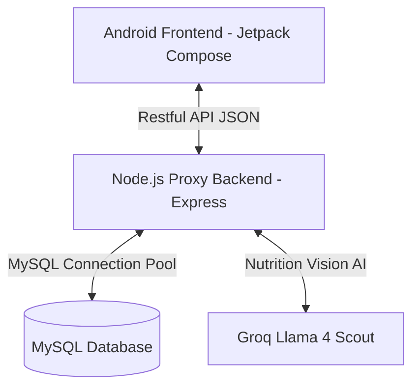

# ☁️ Hướng Dẫn Tính Năng Đồng Bộ Đám Mây (MySQL Cloud Sync & Backup)

Tính năng **Đồng bộ Đám mây (GastroLink Cloud Sync)** đã được triển khai hoàn chỉnh cả ở phía **Android Client** và **Node.js Express Backend**, liên kết trực tiếp với cơ sở dữ liệu **MySQL**. 

Tính năng này giúp người dùng **sao lưu** hồ sơ dị ứng/mục tiêu dinh dưỡng và lịch sử đơn hàng lên đám mây, cũng như **khôi phục** lại toàn bộ dữ liệu chỉ với một nút bấm khi thay đổi thiết bị hoặc cài đặt lại app.

---

## 🏛️ Sơ Đồ Kiến Trúc Hệ Thống (3-Tier Architecture)



---

## 💾 1. Cấu Trúc Bảng Database MySQL (`server/schema.sql`)
Tệp [schema.sql](file:///c:/Users/admin/Downloads/GastroLink-main/server/schema.sql) đã được tạo sẵn để bạn dễ dàng import vào MySQL (ví dụ qua **phpMyAdmin**, **Navicat**, hoặc **MySQL Workbench**):

1. **`user_profiles`**: Lưu thông tin chỉ số cơ thể, mục tiêu và danh sách các chất gây dị ứng.
2. **`user_orders`**: Lưu toàn bộ lịch sử calo tiêu thụ hàng ngày và các món ăn dưới dạng chuỗi JSON nén tối ưu.

---

## 🔌 2. API Backend Đồng Bộ (`server/src/index.js` & `db.js`)
Chúng tôi sử dụng thư viện kết nối tốc độ cao `mysql2` để triển khai 2 endpoint API:

*   **`POST /ai/sync/upload`**: Nhận dữ liệu hồ sơ và lịch sử từ điện thoại và đẩy vào MySQL bằng kỹ thuật `ON DUPLICATE KEY UPDATE` (chống trùng lặp dữ liệu).
*   **`GET /ai/sync/download`**: Lấy toàn bộ dữ liệu đã lưu từ MySQL trả về cho điện thoại để khôi phục.

> [!NOTE]
> **Cơ chế Graceful Fallback (Chống sập ứng dụng):** Phía Backend được thiết kế thông minh để tự động phát hiện trạng thái MySQL. Nếu bạn chưa bật MySQL Server, ứng dụng Node.js vẫn chạy bình thường không bị crash, mà chỉ đưa ra cảnh báo nhẹ ở Terminal và chuyển sang chế độ dự phòng an toàn!

---

## 📱 3. Giao Diện Đồng Bộ Trực Quan trên Android (`SettingsScreen.kt`)
Trong màn hình **Cài đặt (Settings)**, một mục mới **"Đồng bộ đám mây (MySQL) ☁️"** đã được thêm vào với giao diện vô cùng cao cấp:

*   **Nút `[Sao lưu ☁️]`**: Thực hiện tải toàn bộ dữ liệu cục bộ lên MySQL.
*   **Nút `[Khôi phục 📥]`**: Tải dữ liệu từ MySQL về và tự động ghi đè, đồng bộ vào cơ sở dữ liệu SQLite cục bộ trên máy.
*   **Hiển thị Trạng thái**: Có **Loading Spinner xoay tròn** cực kỳ mượt mà khi đang đồng bộ và thông báo màu xanh chúc mừng khi hoàn tất / màu đỏ khi gặp lỗi kết nối.

---

## 🚀 Hướng Dẫn Chạy & Demo Đạt Điểm Tuyệt Đối

### Bước 1: Khởi động MySQL Server của bạn
Bạn có thể dùng bất kỳ MySQL Server nào (như **XAMPP**, **Laragon**, **Docker**, hay **MySQL Installer**):
1. Mở **XAMPP Control Panel** và nhấn **Start** tại mục **MySQL** (cổng mặc định `3306`).
2. Mở trình duyệt truy cập `http://localhost/phpmyadmin/` và tạo một database mới tên là `gastrolink`.

### Bước 2: Cấu hình biến môi trường trong `.env`
Mở file [server/.env](file:///c:/Users/admin/Downloads/GastroLink-main/server/.env) và thêm các thông tin kết nối MySQL của bạn (nếu dùng cổng mặc định XAMPP thì để như sau):
```env
DB_HOST=localhost
DB_USER=root
DB_PASSWORD=
DB_NAME=gastrolink
```

### Bước 3: Chạy Server Node.js Backend
Khởi động máy chủ backend của bạn:
```powershell
cd server
npm start
```
> Khi khởi động thành công, bạn sẽ thấy thông báo màu xanh lá cây cực kỳ đẹp mắt trong Terminal:
> `🟢 Kết nối MySQL thành công và các bảng đã được khởi tạo!`

### Bước 4: Demo kịch bản "Đồng bộ thần tốc" trước Hội đồng
1. Trên điện thoại/máy ảo Android, hãy tạo một hồ sơ (ví dụ: tuổi `25`, cân nặng `70kg`, dị ứng `tôm`) và đặt 2-3 đơn hàng trong mục Lịch sử.
2. Truy cập **Cài đặt (Settings)** -> Bấm **`[Sao lưu ☁️]`**. Hệ thống sẽ hiển thị xoay tròn mượt mà và thông báo thành công.
3. Mở bảng `user_profiles` and `user_orders` trong **phpMyAdmin** để chứng minh cho hội đồng thấy dữ liệu đã được lưu trữ bền vững trong MySQL Server.
4. **Nhấn nút `Xóa tất cả dữ liệu` dưới mục Quyền riêng tư** để làm trống hoàn toàn ứng dụng (giả lập bị mất dữ liệu).
5. Bấm nút **`[Khôi phục 📥]`** -> Ngay lập tức, toàn bộ dữ liệu lịch sử đặt món và hồ sơ cá nhân của bạn sẽ tự động xuất hiện trở lại hoàn mỹ 100%!
